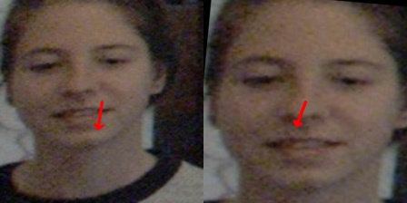

# Gaze Dataset Pre-processing (Normalization)

This repository provides standardized tools for pre-processing and normalizing several widely-used gaze estimation datasets. 
The core logic follows the standardized gaze normalization protocol (Xucong Zhang et al.).

---

## 1. ETH-XGaze (`normalize_xgaze.py`)

This implementation is based on the normalization by [Xucong Zhang](https://github.com/xucong-zhang/data-preprocessing-gaze) with several refinements.

> [!IMPORTANT]
> We use updated camera calibrations and annotations from our previous work to correct errors caused by original miscalibration and inaccuracies in legacy face landmark detection.
> You may download the updated calibration and annotation files from the [XGaze3D repository](https://github.com/ut-vision/XGaze3D?tab=readme-ov-file). 


### Raw Data Structure
```yaml
path/to/raw/XGaze/
├── light_meta.yaml
├── data/
│   ├── train/
│   │   └── subject0000/
│   │       └── frame0000.jpg             # Raw image frames
│   └── annotation_updated/
│       └── subject0000_update.csv        # Updated annotation files
├── calibration/                          # Original calibration, not used
|
└── avg_cams_final/
    └── subject0000/
        └── cam00.xml ... cam17.xml       # Subject-specific updated calibration
```

### Execution
```bash
python normalize_xgaze.py \
    --xgaze_raw_dir <path/to/raw/XGaze/> \
    --output_dir <output_dir>
```


---

## 2. MPIIFaceGaze (`normalize_mpii.py`)

The pre-processing for MPIIFaceGaze follows the same pipeline as ETH-XGaze, adapted for the MPII dataset structure.

### Execution
```bash
python normalize_mpii.py \
    --mpiifacegaze_raw_dir <path/to/MPIIFaceGaze> \
    --output_dir <output_dir>
```

Then, run the following script to upsample each subject to exactly 3,000 samples via random duplication
```bash
python upsample_mpii.py \
    --data_dir <output_dir>
```

---

## 3. EYEDIAP (`normalize_eyediap.py`)

The dataset used in the paper was typically normalized using legacy internal code (by Seonwook Park). 
That implementation utilized a **TensorFlow 1.x framework** and 3DMM-based head pose estimation (`eos` model), which is difficult to publish or reproduce in modern environments.


In this repository, we provide a simplified, modern implementation of the gaze normalization process consistent with the ETH-XGaze pipeline. 
Note that the processed data is slightly different from the one used in the paper.


### Raw Data Structure
```yaml
path/to/raw/EYEDIAP/
├── Annotations/
├── Data/
├── Example/
├── MD5SUM.TXT
├── Metadata/
├── Readme.txt
└── Scripts/
```

### Execution
```bash
python normalize_eyediap.py \
    --eyediap_raw_dir <path/to/EYEDIAP_raw> \
    --output_dir <output_dir> \
    --frame_step 5 ## This does not influence much on testing

```

### Baseline Comparison (UniGaze-H trained on ETH-XGaze)

| Dataset | In the Paper (Table 1) | This Repo |
| :--- | :--- | :--- |
| **EYEDIAP CS** | 4.65° | 4.78° |
| **EYEDIAP FT** | 8.13° | 9.00° |


---

## 4. GazeCapture

For GazeCapture, please refer to the [STED pre-processing script](https://github.com/swook/faze_preprocess/blob/master/create_hdf_files_for_sted.py).


---


## 5. Gaze360 (`normalize_gaze360.py`)

Gaze360 requires unique handling because the original dataset was captured with a 360-degree camera and does not contain standard pinhole camera parameters.

* **Cropping:** We use the script provided by [Phi-Lab](https://phi-ai.buaa.edu.cn/Gazehub/3D-method/#gaze360-physically-unconstrained-gaze-estimation-in-the-wild) to get a roughly cropped face image and its gaze label (3D gaze vector).
* **Normalization:** We re-run the normalization using **dummy camera parameters**.
* **Vector Conversion:** The 3D gaze vector definition of Phi-Lab differs from our convention. We have included specific conversion steps to ensure global consistency across this repository.

### Input Structure (After running the script of Phi-Lab)
```text
path/to/intermediate_Gaze360/
├── Image/
│   ├── train/
│   │   └── Face/
│   │       └── 7371.jpg
│   ├── test/
│   └── val/
└── Label/
    ├── train.label
    ├── test.label
    └── val.label
```

### Execution
```bash
python normalize_gaze360.py \
    --gaze360_intermediate_dir <path/to/intermediate_Gaze360> \
    --output_dir <output_dir> \
    --focal_norm 860 \
    --distance_norm 320 \
    --roi_size 448 \
    --save_size 224

## These normalization parameters are empirically adjusted to ensure that the facial region scope is similar to other datasets.
```
**Example: Original Crop (left) vs. Normalized Patch (right)**




## Finally, Data Check

To verify the processed datasets and visualize the gaze vectors, use the provided reading script:

```bash
python read_data.py \
    --data_dir <path to the processed dataset>
```
